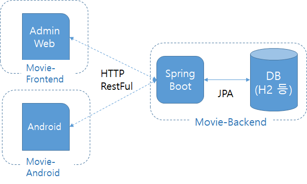
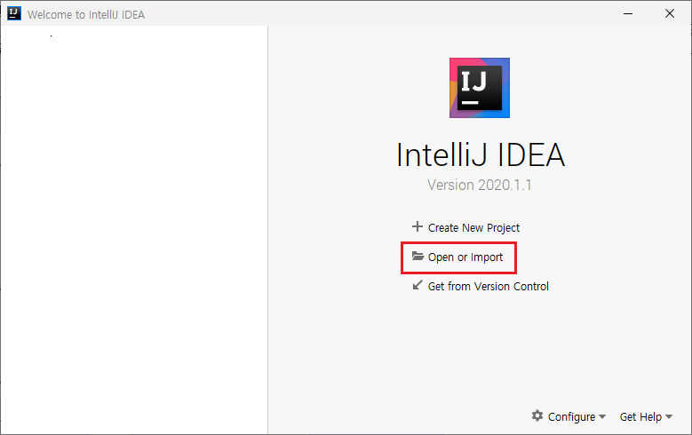
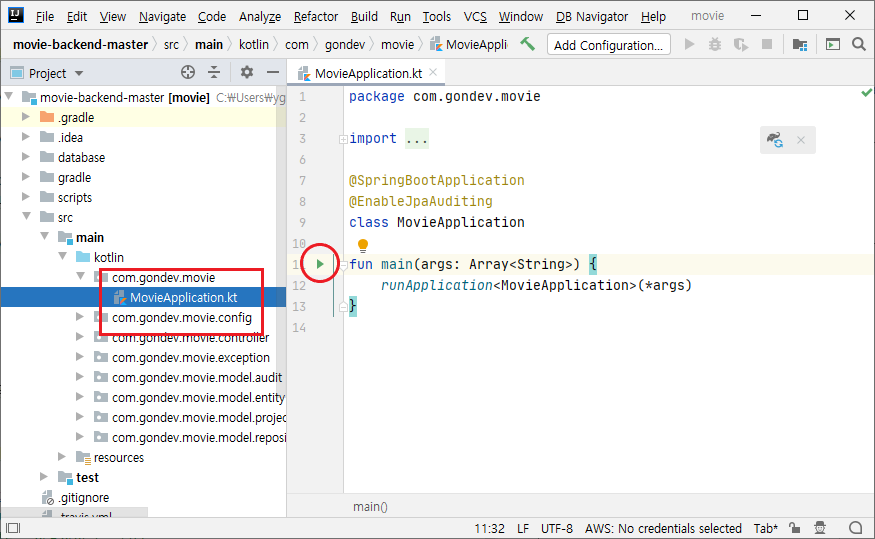
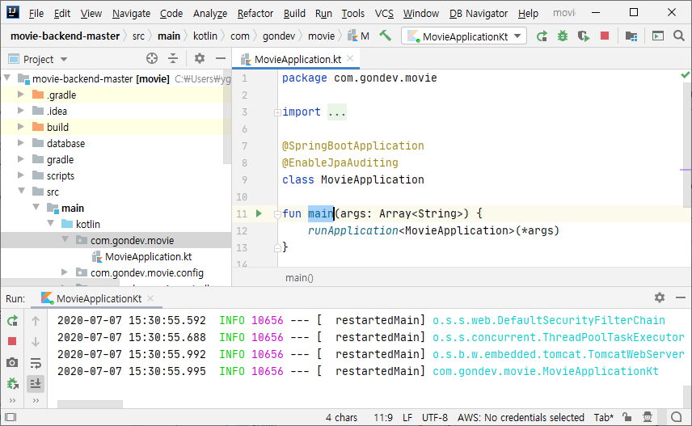

# Movie-Backend
이 프로젝트는 개인적으로 만든 간단한 영화 정보를 제공하는 백엔드 서버입니다

## 목적
이 프로젝트의 목적은 Spring 공부 겸 [movie-android](https://github.com/Young-Gon/movie-android) 백엔드 서버 제작 입니다.

## 구성
이 프로젝트는 3개의 저장소로 구성되어 있습니다

* [movie-android](https://github.com/Young-Gon/movie-android): 안드로이드 클라이언트 입니다   
  코틀린으로 제작된 MVVM 학습용 앱입니다 
* [movie-backend](https://github.com/Young-Gon/movie-backend): 이 프로젝트입니다   
  안드로이드 엡에 영화 정보를 제공 합니다
* [movie-froentend](https://github.com/Young-Gon/movie-frontend): 백엔드에 영화 정보를 입력하는 화면입니다   
  Nuxt.js와 TypeScript로 제작 되어 있습니다
  
    
## 특징
1. spring boot 2.0으로 제작 되었습니다
2. SQL 메핑 툴로 JPA를 사용 합니다
3. 언어로 자바 대신 코틀린을 사용합니다
    > 자바 대신 코틀린을 사용하는 이유
    >  1. 롬북을 사용할 필요가 없다
    >  2. 3세대 언어특징(람다식, 널 세이프티 변수등)을 사용할수 있다

## 설치 방법
스프링 부트를 잘아시는 분은 필요 없는 부분이지만, 저처럼 처음인 분들을 위해 작성합니다

* 필요한 프로그램: [인텔리J IDE - Community (IntelliJ IDE - Community)](https://www.jetbrains.com/ko-kr/idea/download/download-thanks.html?platform=windows&code=IIC)      
    > 유료인 Ultimate 버전과 무료인Community 버전이 있습니다. 이 프로젝트에서는 무료인 Community 버전으로 충분하니 Community 버전으로 진행합니다   
    Ultimate버전이 있으신 분은 Ultimate를 사용하시면 됩니다

1. 일단 인텔리J를 다운 받고 설치 합니다
2. 이 프로젝트를 다운 받고 적당한 곳에 압축을 풉니다
3. 인텔리J를 실행 합니다   
    
4. open or import를 선택 합니다
5. 폴더 탐색창이 열리면 방금 풀어놓은 프로젝트를 선택 합니다
6. 프로젝트가 열리고 빌드가 시작됩니다
7. 서버 실행은 빌드가 완료되고 난후 오른쪽 탐색창에서 /src/main/kotlin/com.gondev.movie/MovieApplication.kt 파일로 이동하신 후 `main`()함수 옆에 있는 실행 화살표를 클릭하시면 실행이 됩니다   
      
8. 정상적으로 실행된 화면    
    
9. 정상적으로 동작하는지 확인해 보기
   > 정상적으로 구동이 완료 되면, 다음 링크를 클릭하면 영화정보를 보여 줍니다   
   > http://localhost:8080/movie?type=1